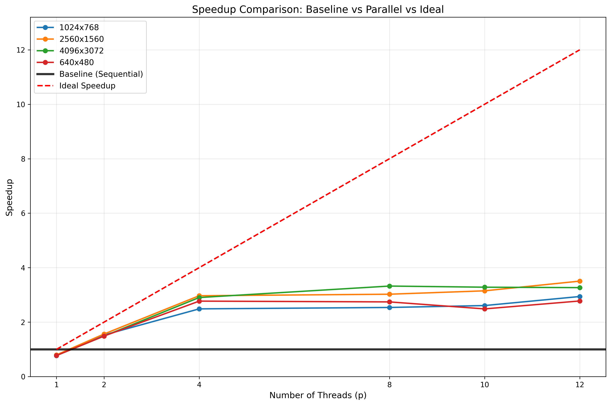
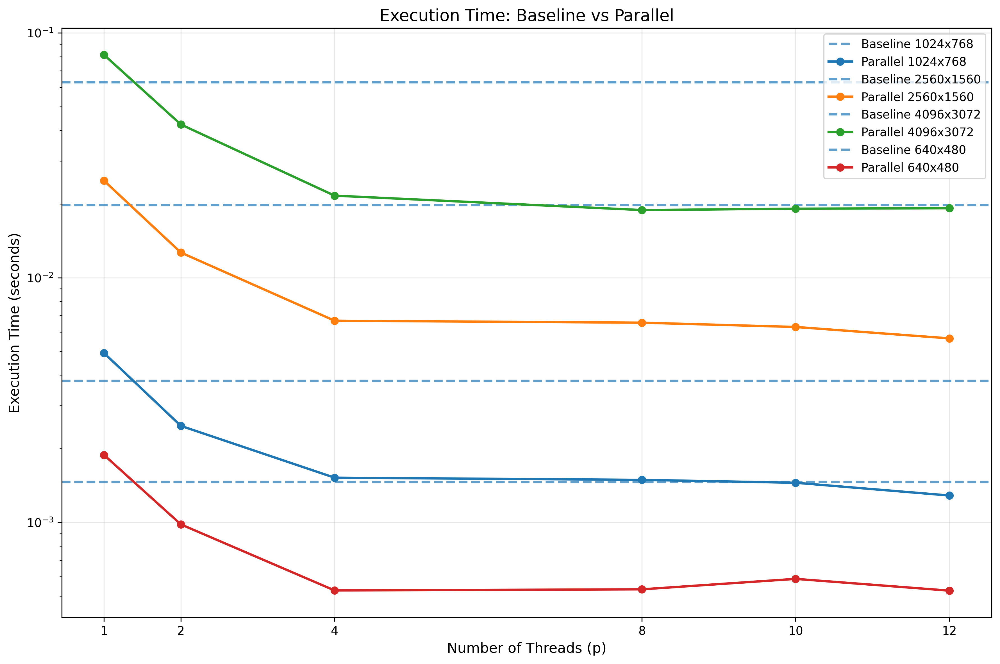
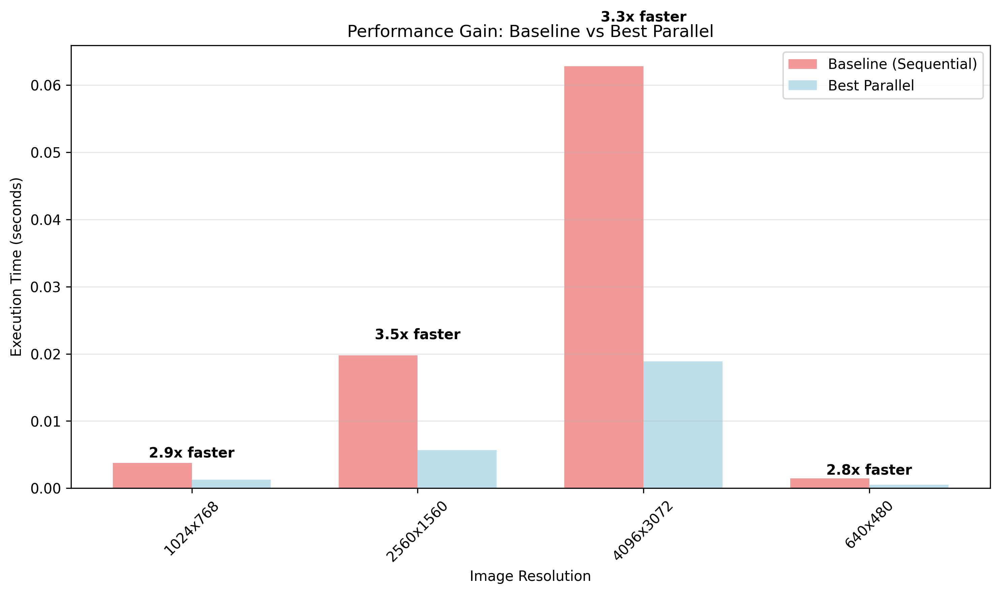
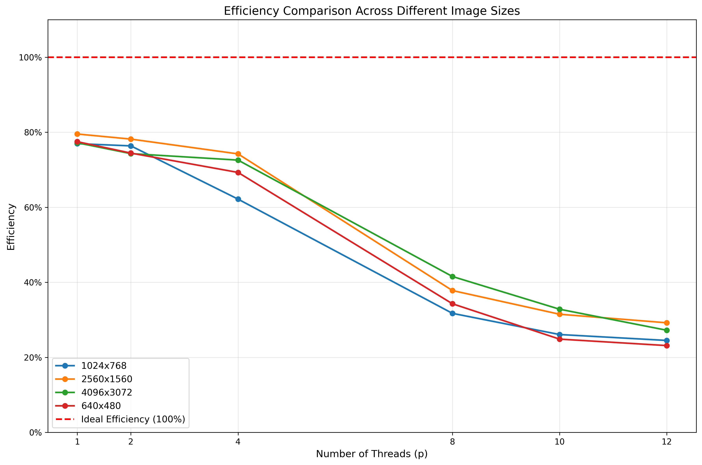

# Báo cáo Phân tích Ảnh hưởng của Kích thước Bài toán

Phân tích hiệu năng của thuật toán làm mờ ảnh song song với các kích thước ảnh đầu vào khác nhau.

**Cấu hình thực nghiệm:**
- Số lần chạy mỗi test: 2
- Số thread được test: [1, 2, 4, 8, 10, 12]
- Tổng số file ảnh được phân tích: 4

## Tóm tắt so sánh

| Tên file | Độ phân giải | Baseline (s) | Max Speedup | Max Efficiency | Threads tối ưu |
|----------|--------------|--------------|-------------|----------------|----------------|
| `input_1024x768.jpg` | 1024x768 | 0.0038 | 2.94x | 24.5% | 12 |
| `input_2560x1560.jpg` | 2560x1560 | 0.0198 | 3.51x | 29.2% | 12 |
| `input_4096x3072.jpg` | 4096x3072 | 0.0628 | 3.32x | 41.6% | 8 |
| `input_640x480.jpg` | 640x480 | 0.0015 | 2.78x | 23.1% | 12 |

## 1. Kết quả cho ảnh: `input_1024x768.jpg` (1024x768)

**Thời gian chạy tuần tự (baseline): 0.0038 giây**

| Threads | Time (s) | Speedup | Efficiency | So với lý tưởng |
|---------|----------|---------|------------|-----------------|
| 1       | 0.0049   | 0.77   x | 77.0%      | 77.0%           |
| 2       | 0.0025   | 1.53   x | 76.4%      | 76.4%           |
| 4       | 0.0015   | 2.49   x | 62.2%      | 62.2%           |
| 8       | 0.0015   | 2.54   x | 31.7%      | 31.7%           |
| 10      | 0.0015   | 2.61   x | 26.1%      | 26.1%           |
| 12      | 0.0013   | 2.94   x | 24.5%      | 24.5%           |

**Phân tích:**
- Speedup tốt nhất: **2.94x** với 12 threads
- Hiệu suất đạt được: **24.5%** so với lý tưởng
- Overhead song song hóa: **0.0011s** (29.95%)

## 2. Kết quả cho ảnh: `input_2560x1560.jpg` (2560x1560)

**Thời gian chạy tuần tự (baseline): 0.0198 giây**

| Threads | Time (s) | Speedup | Efficiency | So với lý tưởng |
|---------|----------|---------|------------|-----------------|
| 1       | 0.0249   | 0.80   x | 79.5%      | 79.5%           |
| 2       | 0.0127   | 1.56   x | 78.2%      | 78.2%           |
| 4       | 0.0067   | 2.97   x | 74.2%      | 74.2%           |
| 8       | 0.0065   | 3.02   x | 37.8%      | 37.8%           |
| 10      | 0.0063   | 3.15   x | 31.5%      | 31.5%           |
| 12      | 0.0056   | 3.51   x | 29.2%      | 29.2%           |

**Phân tích:**
- Speedup tốt nhất: **3.51x** với 12 threads
- Hiệu suất đạt được: **29.2%** so với lý tưởng
- Overhead song song hóa: **0.0051s** (25.74%)

## 3. Kết quả cho ảnh: `input_4096x3072.jpg` (4096x3072)

**Thời gian chạy tuần tự (baseline): 0.0628 giây**

| Threads | Time (s) | Speedup | Efficiency | So với lý tưởng |
|---------|----------|---------|------------|-----------------|
| 1       | 0.0814   | 0.77   x | 77.2%      | 77.2%           |
| 2       | 0.0423   | 1.49   x | 74.3%      | 74.3%           |
| 4       | 0.0216   | 2.90   x | 72.6%      | 72.6%           |
| 8       | 0.0189   | 3.32   x | 41.6%      | 41.6%           |
| 10      | 0.0191   | 3.28   x | 32.8%      | 32.8%           |
| 12      | 0.0192   | 3.27   x | 27.2%      | 27.2%           |

**Phân tích:**
- Speedup tốt nhất: **3.32x** với 8 threads
- Hiệu suất đạt được: **41.6%** so với lý tưởng
- Overhead song song hóa: **0.0186s** (29.55%)

## 4. Kết quả cho ảnh: `input_640x480.jpg` (640x480)

**Thời gian chạy tuần tự (baseline): 0.0015 giây**

| Threads | Time (s) | Speedup | Efficiency | So với lý tưởng |
|---------|----------|---------|------------|-----------------|
| 1       | 0.0019   | 0.77   x | 77.5%      | 77.5%           |
| 2       | 0.0010   | 1.49   x | 74.4%      | 74.4%           |
| 4       | 0.0005   | 2.77   x | 69.3%      | 69.3%           |
| 8       | 0.0005   | 2.74   x | 34.3%      | 34.3%           |
| 10      | 0.0006   | 2.49   x | 24.9%      | 24.9%           |
| 12      | 0.0005   | 2.78   x | 23.1%      | 23.1%           |

**Phân tích:**
- Speedup tốt nhất: **2.78x** với 12 threads
- Hiệu suất đạt được: **23.1%** so với lý tưởng
- Overhead song song hóa: **0.0004s** (29.07%)

## So sánh tổng hợp và Phân tích Định luật Amdahl

### Biểu đồ so sánh Baseline vs Parallel:

*Biểu đồ speedup cho thấy sự cải thiện của parallel so với baseline (đường đen nằm ngang)*

*So sánh trực tiếp thời gian thực thi: đường đứt nét là baseline, đường liền là parallel*

*Biểu đồ cột cho thấy mức cải thiện hiệu năng với từng kích thước ảnh*

*Hiệu suất sử dụng tài nguyên với các số threads khác nhau*

### Quan sát và Phân tích:

#### 1. Ảnh hưởng của kích thước bài toán:
- **Ảnh nhỏ nhất** (`input_640x480.jpg`): Speedup tối đa = 2.78x
- **Ảnh lớn nhất** (`input_4096x3072.jpg`): Speedup tối đa = 3.32x
- **Cải thiện**: Ảnh lớn đạt speedup cao hơn 19.7%

#### 2. Minh chứng Định luật Amdahl:
Định luật Amdahl: `Speedup_max = 1 / (s + (1-s)/p)` với `s` là phần không song song được.

- **1024x768**: Phần tuần tự ước tính ≈ 28.0%
- **2560x1560**: Phần tuần tự ước tính ≈ 22.0%
- **4096x3072**: Phần tuần tự ước tính ≈ 24.3%
- **640x480**: Phần tuần tự ước tính ≈ 30.2%

#### 3. Nguyên nhân overhead thấp hơn với ảnh lớn:
- **Overhead cố định**: Thời gian tạo/hủy thread, đồng bộ hóa không thay đổi theo kích thước ảnh
- **Khối lượng tính toán tỷ lệ**: Với ảnh lớn hơn, thời gian xử lý pixel tăng tuyến tính
- **Tỷ lệ overhead/computation**: Giảm đáng kể với ảnh lớn → Speedup tiến gần đến lý tưởng

#### 4. Điểm bão hòa:
Tất cả các kích thước đều cho thấy hiện tượng 'bão hòa' khi tăng số thread quá mức:
- **Nguyên nhân**: Overhead quản lý thread vượt qua lợi ích song song hóa
- **Số thread tối ưu**: Thường từ 4-8 threads trên hệ thống này
- **Khuyến nghị**: Nên chọn số thread = số lõi vật lý của CPU

### Kết luận:
Thực nghiệm này minh chứng rõ ràng cho **Định luật Amdahl** và tầm quan trọng của việc chọn kích thước bài toán phù hợp khi đánh giá hiệu năng song song. Với các ứng dụng thực tế, việc tối ưu hóa thuật toán song song nên tập trung vào các bài toán có kích thước lớn để đạt hiệu quả tốt nhất.
