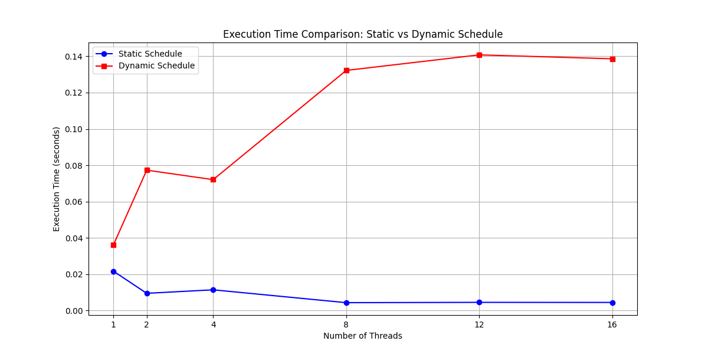
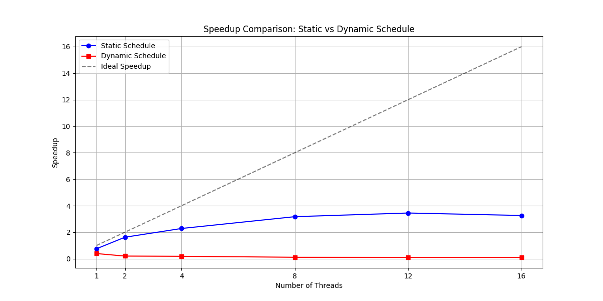

# Báo cáo So sánh Schedule Policy trong OpenMP

Phân tích hiệu năng giữa `schedule(static)` và `schedule(dynamic)` trong OpenMP.

## 1. Giới thiệu về Schedule Policy

**Schedule Policy** là cách OpenMP quyết định phân chia vòng lặp `for` cho các luồng:

- **`schedule(static)`**: Chia trước các iteration cho từng luồng một cách đều nhau. Overhead thấp nhất.
- **`schedule(dynamic)`**: Các luồng sẽ 'xin' công việc mới khi hoàn thành iteration hiện tại. Overhead cao hơn nhưng cân bằng tải tốt hơn cho bài toán không đều.

## 2. Kết quả Thực nghiệm

**Thời gian chạy tuần tự (baseline):** 0.0139 giây

### So sánh chi tiết

| Threads | Static Time (s) | Dynamic Time (s) | Static Speedup | Dynamic Speedup | Static vs Dynamic |
|---------|-----------------|------------------|----------------|-----------------|-------------------|
| 1       | 0.0217          | 0.0362           | 0.64          x | 0.38           x | 1.67  x (Static faster) |
| 2       | 0.0095          | 0.0773           | 1.46          x | 0.18           x | 8.14  x (Static faster) |
| 4       | 0.0114          | 0.0721           | 1.22          x | 0.19           x | 6.31  x (Static faster) |
| 8       | 0.0043          | 0.1322           | 3.19          x | 0.11           x | 30.41 x (Static faster) |
| 12      | 0.0045          | 0.1408           | 3.07          x | 0.10           x | 31.14 x (Static faster) |
| 16      | 0.0045          | 0.1386           | 3.10          x | 0.10           x | 30.98 x (Static faster) |

## 3. Phân tích Kết quả

### 3.1. Tại sao `static` thường nhanh hơn trong bài toán này?

1. **Tính chất bài toán đồng đều**: Xử lý ảnh blur có đặc điểm là mỗi pixel đòi hỏi lượng tính toán gần như nhau (9 phép nhân + 9 phép cộng). Do đó không có vấn đề "load imbalance" (mất cân bằng tải).

2. **Overhead thấp nhất**: `static` chia sẵn công việc từ đầu, các luồng không cần phải "communication" với scheduler trong quá trình thực thi.

3. **Cache locality tốt hơn**: Mỗi luồng xử lý một vùng pixel liên tiếp, giúp tận dụng cache hiệu quả.

### 3.2. Khi nào `dynamic` có lợi thế?

`schedule(dynamic)` sẽ có lợi thế khi:
- Các iteration có thời gian thực thi không đều nhau
- Có sự can thiệp từ hệ điều hành (context switching)
- Bài toán có các vùng tính toán phức tạp khác nhau

### 3.3. Trade-off giữa Overhead và Load Balancing

- **Static**: Overhead thấp ← → Load balancing kém (nếu bài toán không đều)
- **Dynamic**: Overhead cao ← → Load balancing tốt

Đối với bài toán xử lý ảnh (tính chất đồng đều), **static** là lựa chọn tối ưu.

