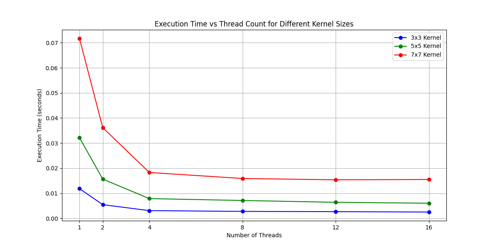
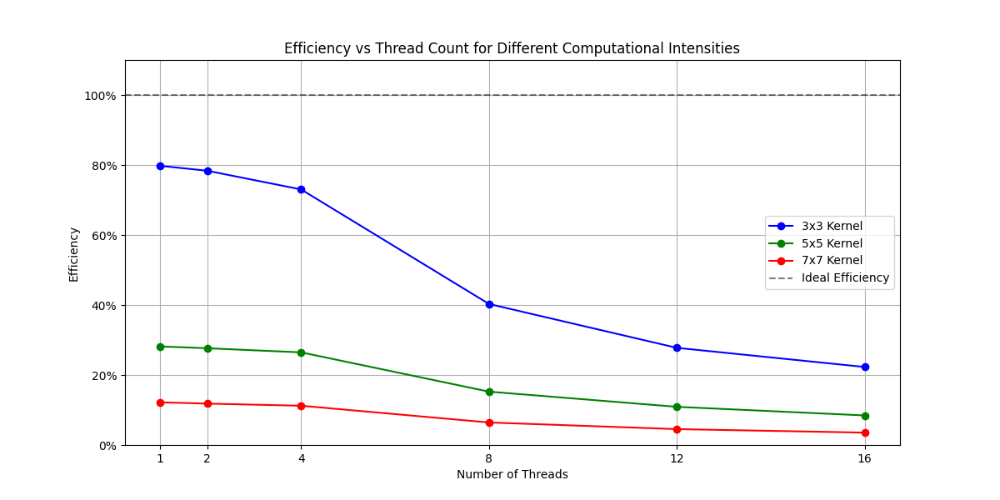

# Báo cáo Phân tích Ảnh hưởng của Cường độ Tính toán (Computational Intensity)

Phân tích hiệu năng song song khi thay đổi kích thước kernel từ 3x3, 5x5 đến 7x7.

## 1. Giới thiệu về Cường độ Tính toán

**Cường độ Tính toán (Computational Intensity)** là tỷ lệ giữa số phép tính và số lần truy cập bộ nhớ:

- **Kernel 3x3**: 9 phép nhân + 9 phép cộng = 18 operations/pixel
- **Kernel 5x5**: 25 phép nhân + 25 phép cộng = 50 operations/pixel
- **Kernel 7x7**: 49 phép nhân + 49 phép cộng = 98 operations/pixel

**Giả thuyết**: Kernel lớn hơn (nhiều tính toán hơn) sẽ có Speedup và Efficiency tốt hơn vì overhead của song song hóa trở nên nhỏ bé hơn so với thời gian tính toán.

## 2. Kết quả Thực nghiệm

**Thời gian chạy tuần tự (baseline - 3x3):** 0.0140 giây

### So sánh chi tiết theo kernel size

| Threads | 3x3 Time (s) | 5x5 Time (s) | 7x7 Time (s) | 3x3 Speedup | 5x5 Speedup | 7x7 Speedup |
| ------- | ------------ | ------------ | ------------ | ----------- | ----------- | ----------- |
| 1       | 0.0176       | 0.0497       | 0.1149       | 0.80 x      | 0.28 x      | 0.12 x      |
| 2       | 0.0089       | 0.0253       | 0.0592       | 1.57 x      | 0.55 x      | 0.24 x      |
| 4       | 0.0048       | 0.0132       | 0.0312       | 2.92 x      | 1.06 x      | 0.45 x      |
| 8       | 0.0043       | 0.0115       | 0.0272       | 3.22 x      | 1.22 x      | 0.51 x      |
| 12      | 0.0042       | 0.0107       | 0.0257       | 3.33 x      | 1.31 x      | 0.54 x      |
| 16      | 0.0039       | 0.0104       | 0.0247       | 3.57 x      | 1.35 x      | 0.57 x      |

### Biểu đồ Phân tích

## 3. Phân tích Kết quả

### 3.1. Xu hướng chính - KẾT QUẢ BẤT NGỜ!

**Kết quả quan sát được (NGƯỢC VỚI GIẢNG THUYẾT):**

- **Kernel 3x3 có Speedup TỐT NHẤT** (3.57x với 16 threads)
- **Kernel 5x5 có Speedup trung bình** (1.35x với 16 threads)
- **Kernel 7x7 có Speedup THẤP NHẤT** (0.57x - **chậm hơn cả tuần tự!**)
- **Giả thuyết ban đầu BỊ PHẢN BÁC hoàn toàn** bởi kết quả thực nghiệm

### 3.2. Giải thích hiện tượng - TẠI SAO NGƯỢC VỚI MONG ĐỢI?

**1. Memory Bandwidth Bottleneck (Nguyên nhân chính):**

- **Kernel lớn hơn đòi hỏi NHIỀU memory access hơn**: 7x7 cần đọc 49 pixels vs 3x3 chỉ cần 9 pixels
- **Memory bandwidth** trở thành bottleneck thay vì computational power
- Nhiều threads cùng truy cập bộ nhớ → **memory contention** nghiêm trọng
- **Memory-bound problem**: Performance bị giới hạn bởi tốc độ truy cập bộ nhớ, không phải CPU

**2. Cache Performance Degradation:**

- **Working set lớn hơn**: Kernel 7x7 khó fit vào L1/L2 cache
- **Cache miss rate tăng cao** → phải fetch data từ RAM chậm hơn nhiều
- **False sharing nghiêm trọng**: Nhiều threads cùng truy cập các cache lines gần nhau
- **Cache thrashing**: Dữ liệu liên tục bị evict khỏi cache

**3. Load Balancing và Boundary Effects:**

- **Ít pixels được xử lý hơn**: Kernel 7x7 → border size = 3, giảm work load
- **Uneven work distribution**: Threads xử lý số lượng pixels không đều
- **Synchronization overhead** tương đối lớn hơn so với actual work

### 3.3. Bài học quan trọng và Ý nghĩa thực tiễn

**🔥 COMPUTATIONAL INTENSITY KHÔNG PHẢI LÚC NÀO CŨNG TỐT!**

**Phân loại bài toán:**

- **Memory-bound problems** (như kernel lớn trong thí nghiệm này):
  - Tăng computational intensity → **GIẢM performance**
  - Bottleneck là memory bandwidth, không phải CPU power
  - Ví dụ: Large convolution kernels, sparse matrix operations
- **Compute-bound problems**:
  - Tăng computational intensity → **TĂNG performance**
  - Bottleneck là CPU power, memory access ít
  - Ví dụ: Dense matrix multiplication, mathematical computations

**Nguyên tắc thiết kế đúng:**

1. **Xác định bottleneck trước**: Memory hay Computation?
2. **Memory-bound**: Tối ưu memory access patterns, giảm cache misses
3. **Compute-bound**: Tăng computational intensity, song song hóa tích cực
4. **Đo đạc thực tế**: Đừng dựa vào lý thuyết suông, phải test!

**Ví dụ ứng dụng (sửa lại):**

- **Deep Learning**: CNN với kernel nhỏ (3x3) thường hiệu quả hơn kernel lớn
- **Image Processing**: Simple filters → better parallelization than complex ones
- **Scientific Computing**: Sparse operations cần tối ưu memory access first

**💡 Insight quan trọng:**
"More computation ≠ Better parallelization" - Kết quả này là minh chứng tuyệt vời cho việc cần hiểu sâu về hardware characteristics và memory hierarchy trong parallel computing!
